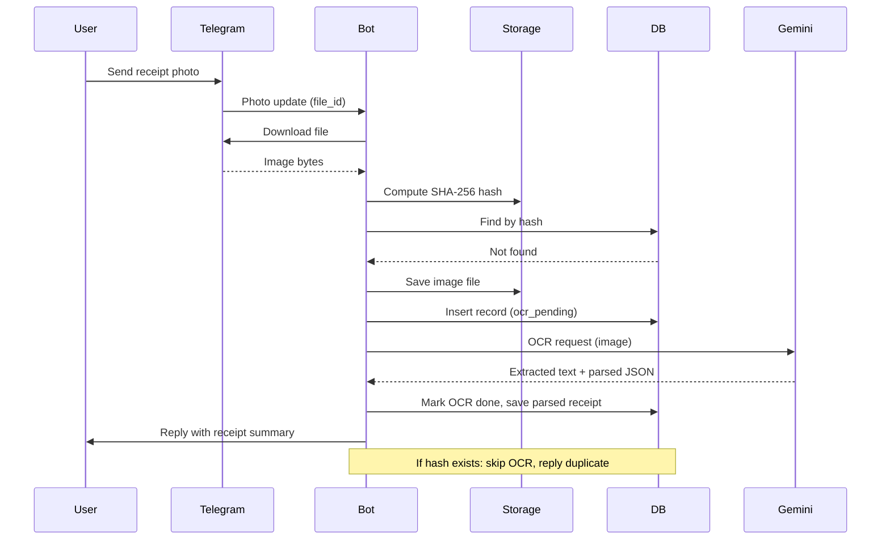

# Kaufbot

Telegram bot that processes receipt photos — extracts text via OCR, parses line items, and stores results. Built in C for minimal footprint.

## Features

- Receipt photo upload via Telegram
- OCR extraction using Google Gemini
- Receipt parsing (store name, line items, totals, payment info)
- Duplicate detection via SHA-256 hashing
- Pluggable storage backends (local filesystem, Supabase)
- Pluggable database backends (SQLite, PostgreSQL)
- Docker support (static binary, scratch image)

## Quick Start

```bash
git clone git@github.com:yfozekosh/kaufbot.git && cd kaufbot
sudo dnf install cmake gcc libcurl-devel sqlite-devel postgresql-devel
cp .env.example .env   # edit with your credentials
./build.sh
./test.sh
source .env && ./build/tgbot
```

Debian/Ubuntu: `apt install cmake gcc libcurl4-openssl-dev libsqlite3-dev libpq-dev`

## Documentation

- [Components](docs/components.md) — component interaction diagram
- [Modules](docs/modules.md) — source module dependency graph
- [Backends](docs/backends.md) — storage/database backend interfaces and data types
- [Deployment](docs/deployment.md) — Docker and bare metal deployment options

## Receipt Processing Flow



## Configuration

Copy `.env.example` to `.env` and set:

Required:
| Variable | Description |
|----------|-------------|
| `TELEGRAM_TOKEN` | Bot token from [@BotFather](https://t.me/BotFather) |
| `GEMINI_API_KEY` | API key from [Google AI Studio](https://makersuite.google.com/app/apikey) |
| `ALLOWED_USER_IDS` | Comma-separated Telegram user IDs |

Optional (storage):
| Variable | Default | Description |
|----------|---------|-------------|
| `STORAGE_BACKEND` | `local` | `local` or `supabase` |
| `STORAGE_PATH` | `/data/files` | Local file storage path |
| `SUPABASE_URL` | — | Supabase project URL |
| `SUPABASE_ANON_KEY` | — | Supabase anon/publishable key |
| `SUPABASE_SERVICE_KEY` | — | Supabase service role key (bypasses RLS) |
| `SUPABASE_BUCKET` | `uploads` | Storage bucket name |

Optional (database):
| Variable | Default | Description |
|----------|---------|-------------|
| `DB_BACKEND` | `sqlite` | `sqlite` or `postgres` |
| `DB_PATH` | `/data/bot.db` | SQLite database path |
| `POSTGRES_HOST` | — | PostgreSQL host |
| `POSTGRES_PORT` | `5432` | PostgreSQL port |
| `POSTGRES_DB` | — | Database name |
| `POSTGRES_USER` | — | Database user |
| `POSTGRES_PASSWORD` | — | PostgreSQL password |

## Usage

Send a photo to the bot on Telegram. It will:
1. Download the image
2. Check for duplicates (by SHA-256 hash)
3. Send to Gemini for OCR
4. Parse receipt data (store, items, totals)
5. Save file and OCR result to storage
6. Reply with parsed receipt summary

Commands:
- `/start` — welcome message
- `/list` — show recent receipts

## Development

### Dev tools

Install lint/format/analysis tools:

```bash
# System-wide (Fedora, requires sudo)
sudo dnf install clang-tools-extra cppcheck lcov

# Or locally into .tools/ (no sudo, no system pollution)
./tools/install.sh --local
source .tools/env.sh
```

### Build targets

```bash
cmake -DBUILD_TESTS=ON -S . -B build
cmake --build build

# Tests
cmake --build build && cd build && ctest --output-on-failure

# Lint & format
cmake --build build --target lint
cmake --build build --target cppcheck
cmake --build build --target format-check

# Coverage
cmake -DBUILD_TESTS=ON -DENABLE_COVERAGE=ON -S . -B build
cmake --build build --target test-coverage    # run tests + generate report
cmake --build build --target coverage-check   # + enforce 60% threshold
```

### IDE (clangd)

`compile_commands.json` is generated automatically. Symlink it to the project root:

```bash
ln -sf build/compile_commands.json .
```

Your editor's clangd extension will pick it up. The `.clangd` config handles cJSON include paths.

### Project structure

```
├── src/
│   ├── main.c              # entry point, lifecycle
│   ├── bot.c / bot.h       # Telegram bot (polling, commands)
│   ├── processor.c / .h    # orchestration (hash, save, OCR, parse)
│   ├── gemini.c / .h       # Gemini API client (OCR + parsing)
│   ├── config.c / .h       # environment variable loading
│   ├── utils.c / utils.h   # shared utilities (GrowBuf, base64, URL encoding)
│   ├── db_backend.h        # database backend interface
│   ├── db.h                # data types (FileRecord, ParsedReceipt)
│   ├── db_sqlite.c         # SQLite implementation
│   ├── db_postgres.c       # PostgreSQL implementation
│   ├── storage_backend.h   # storage backend interface
│   ├── storage.h           # storage utilities (SHA-256, filename, MIME)
│   ├── storage_local.c     # local filesystem implementation
│   └── storage_supabase.c  # Supabase Storage implementation
├── tests/
│   ├── main.c              # test runner (per-module binaries)
│   ├── test_runner.h       # minimal test framework macros
│   ├── test_helpers.h      # shared test helpers
│   ├── test_db.c           # database tests
│   ├── test_json.c         # JSON parsing + Gemini mock tests
│   ├── test_storage.c      # storage utility tests
│   ├── test_config.c       # config loading tests
│   └── test_edge_cases.c   # boundary/edge case tests
├── tools/
│   └── install.sh          # local tool installer
├── third_party/cjson/      # cJSON library (vendored)
├── migrations/             # database schema files
├── .clang-format           # code formatter config
├── .clang-tidy             # static analysis config
├── .clangd                 # IDE config
├── .github/workflows/ci.yml  # CI pipeline
├── build.sh                # build script
├── ci.sh                   # local CI (all checks)
├── test.sh                 # test script
├── run.sh                  # run script
├── CMakeLists.txt          # build configuration
├── Dockerfile              # multi-stage Docker build
└── RULES.md                # coding conventions
```

### Pushing via Docker (separate GitHub identity)

If the host machine's SSH key is linked to a different GitHub user, push from a disposable container with its own deploy key.

```bash
# 1. Generate a deploy key in the host home directory (not ~/.ssh)
ssh-keygen -t ed25519 -f ~/github_deploy_key -N ""

# 2. Add the public key to GitHub → Settings → SSH keys (with write access)
cat ~/github_deploy_key.pub

# 3. Push from an Alpine container using the deploy key
docker run --rm --network host \
  -v "$(pwd)":/repo \
  -v ~/github_deploy_key:/tmp/deploy_key:ro \
  -w /repo \
  alpine:latest sh -c '
    apk add --no-cache git openssh-client > /dev/null 2>&1 &&
    mkdir -p /root/.ssh &&
    cp /tmp/deploy_key /root/.ssh/id_ed25519 &&
    chmod 600 /root/.ssh/id_ed25519 &&
    git config --global user.email "your@email.com" &&
    git config --global user.name "Your Name" &&
    git config --global --add safe.directory /repo &&
    GIT_SSH_COMMAND="ssh -o StrictHostKeyChecking=no" git push origin master
  '
```

> **Why `--network host`?** GitHub SSH (port 22) may be unreachable from Docker's default bridge network on some setups.

### Adding a new backend

1. Implement the interface (`StorageBackendOps` or `DBBackendOps`)
2. Add the `_open` factory function
3. Register in the `*_open` factory in `storage_backend.h` or `db_backend.h`

### Coding conventions

See [RULES.md](RULES.md). Key points:
- Write tests alongside new code
- Never suppress compiler warnings
- 60% minimum code coverage target

## License

MIT License

Copyright (c) 2026 Kaufbot Contributors

Permission is hereby granted, free of charge, to any person obtaining a copy
of this software and associated documentation files (the "Software"), to deal
in the Software without restriction, including without limitation the rights
to use, copy, modify, merge, publish, distribute, sublicense, and/or sell
copies of the Software, and to permit persons to whom the Software is
furnished to do so, subject to the following conditions:

The above copyright notice and this permission notice shall be included in all
copies or substantial portions of the Software.

THE SOFTWARE IS PROVIDED "AS IS", WITHOUT WARRANTY OF ANY KIND, EXPRESS OR
IMPLIED, INCLUDING BUT NOT LIMITED TO THE WARRANTIES OF MERCHANTABILITY,
FITNESS FOR A PARTICULAR PURPOSE AND NONINFRINGEMENT. IN NO EVENT SHALL THE
AUTHORS OR COPYRIGHT HOLDERS BE LIABLE FOR ANY CLAIM, DAMAGES OR OTHER
LIABILITY, WHETHER IN AN ACTION OF CONTRACT, TORT OR OTHERWISE, ARISING FROM,
OUT OF OR IN CONNECTION WITH THE SOFTWARE OR THE USE OR OTHER DEALINGS IN THE
SOFTWARE.
