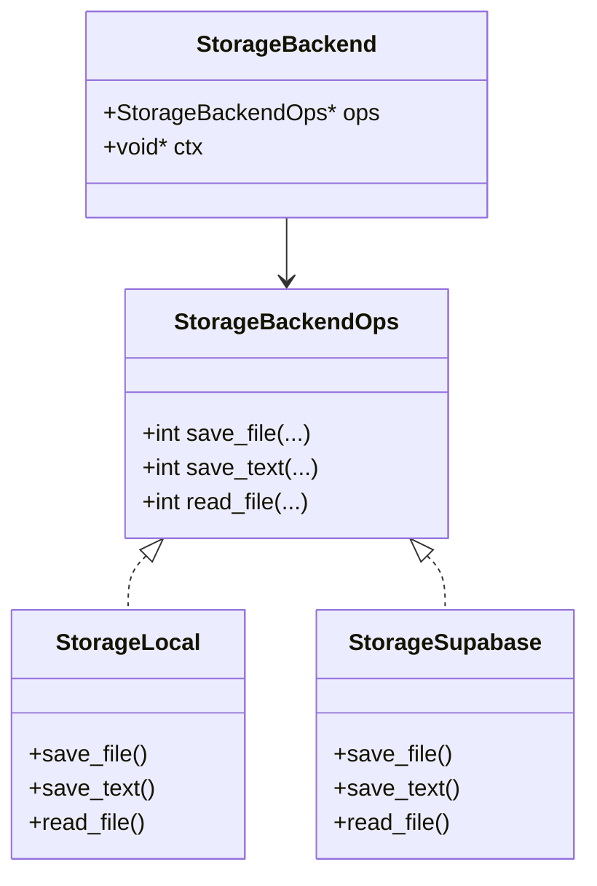
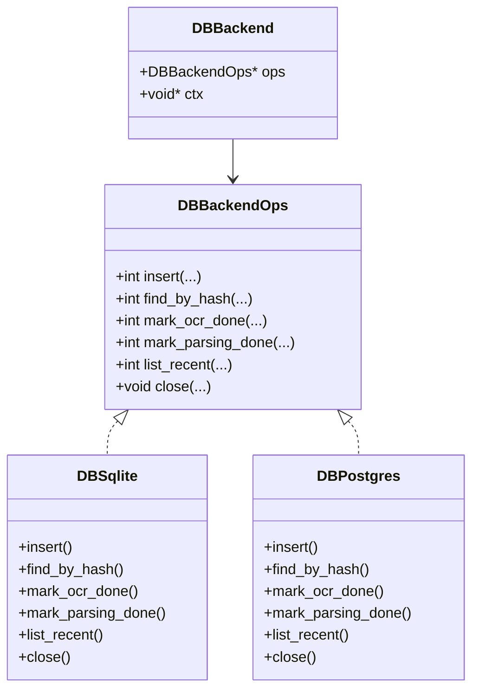
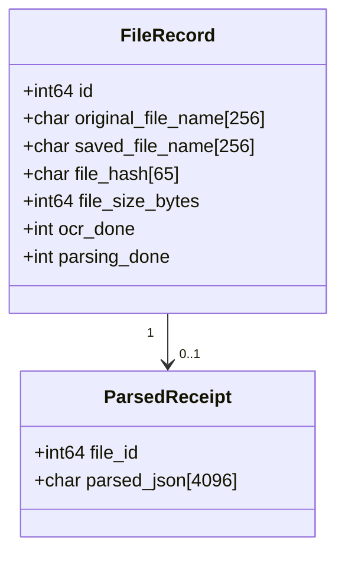

# Backend Interfaces

## Storage Backend

```mermaid
classDiagram
    class StorageBackend {
        +StorageBackendOps* ops
        +void* ctx
    }

    class StorageBackendOps {
        +int save_file(...)
        +int save_text(...)
        +int read_file(...)
    }

    class StorageLocal {
        +save_file()
        +save_text()
        +read_file()
    }

    class StorageSupabase {
        +save_file()
        +save_text()
        +read_file()
    }

    StorageBackend --> StorageBackendOps
    StorageBackendOps <|.. StorageLocal
    StorageBackendOps <|.. StorageSupabase
```

## Database Backend

```mermaid
classDiagram
    class DBBackend {
        +DBBackendOps* ops
        +void* ctx
    }

    class DBBackendOps {
        +int insert(...)
        +int find_by_hash(...)
        +int mark_ocr_done(...)
        +int mark_parsing_done(...)
        +int list_recent(...)
        +void close(...)
    }

    class DBSqlite {
        +insert()
        +find_by_hash()
        +mark_ocr_done()
        +mark_parsing_done()
        +list_recent()
        +close()
    }

    class DBPostgres {
        +insert()
        +find_by_hash()
        +mark_ocr_done()
        +mark_parsing_done()
        +list_recent()
        +close()
    }

    DBBackend --> DBBackendOps
    DBBackendOps <|.. DBSqlite
    DBBackendOps <|.. DBPostgres
```

## Data Types

```mermaid
classDiagram
    class FileRecord {
        +int64 id
        +char original_file_name[256]
        +char saved_file_name[256]
        +char file_hash[65]
        +int64 file_size_bytes
        +int ocr_done
        +int parsing_done
    }

    class ParsedReceipt {
        +int64 file_id
        +char parsed_json[4096]
    }

    FileRecord "1" --> "0..1" ParsedReceipt
```
