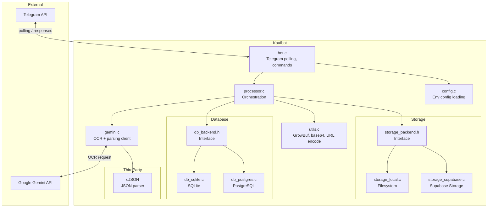

# Components

```mermaid
graph TB
    subgraph External
        TG[Telegram API]
        GM[Google Gemini API]
    end

    subgraph Kaufbot
        BOT[bot.c<br/>Telegram polling, commands]
        PROC[processor.c<br/>Orchestration]
        GEM[gemini.c<br/>OCR + parsing client]
        CFG[config.c<br/>Env config loading]
        UTIL[utils.c<br/>GrowBuf, base64, URL encode]

        subgraph Storage
            SL[storage_local.c<br/>Filesystem]
            SS[storage_supabase.c<br/>Supabase Storage]
            SIFACE[storage_backend.h<br/>Interface]
        end

        subgraph Database
            DBS[db_sqlite.c<br/>SQLite]
            DBP[db_postgres.c<br/>PostgreSQL]
            DIFACE[db_backend.h<br/>Interface]
        end

        subgraph ThirdParty
            CJ[cJSON<br/>JSON parser]
        end
    end

    TG <-->|polling / responses| BOT
    BOT --> PROC
    PROC --> GEM
    GEM <-->|OCR request| GM
    PROC --> SIFACE
    PROC --> DIFACE
    SIFACE --> SL
    SIFACE --> SS
    DIFACE --> DBS
    DIFACE --> DBP
    GEM --> CJ
    BOT --> CFG
    PROC --> UTIL
```
