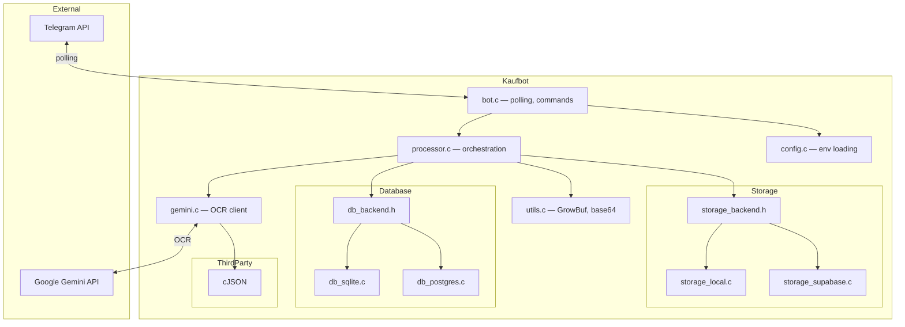

# Components

```mermaid
graph TB
    subgraph External
        TG[Telegram API]
        GM[Google Gemini API]
    end

    subgraph Kaufbot
        BOT["bot.c — polling, commands"]
        PROC["processor.c — orchestration"]
        GEM["gemini.c — OCR client"]
        CFG["config.c — env loading"]
        UTIL["utils.c — GrowBuf, base64"]

        subgraph Storage
            SL["storage_local.c"]
            SS["storage_supabase.c"]
            SIFACE["storage_backend.h"]
        end

        subgraph Database
            DBS["db_sqlite.c"]
            DBP["db_postgres.c"]
            DIFACE["db_backend.h"]
        end

        subgraph ThirdParty
            CJ["cJSON"]
        end
    end

    TG <-->|polling| BOT
    BOT --> PROC
    PROC --> GEM
    GEM <-->|OCR| GM
    PROC --> SIFACE
    PROC --> DIFACE
    SIFACE --> SL
    SIFACE --> SS
    DIFACE --> DBS
    DIFACE --> DBP
    GEM --> CJ
    BOT --> CFG
    PROC --> UTIL
```
