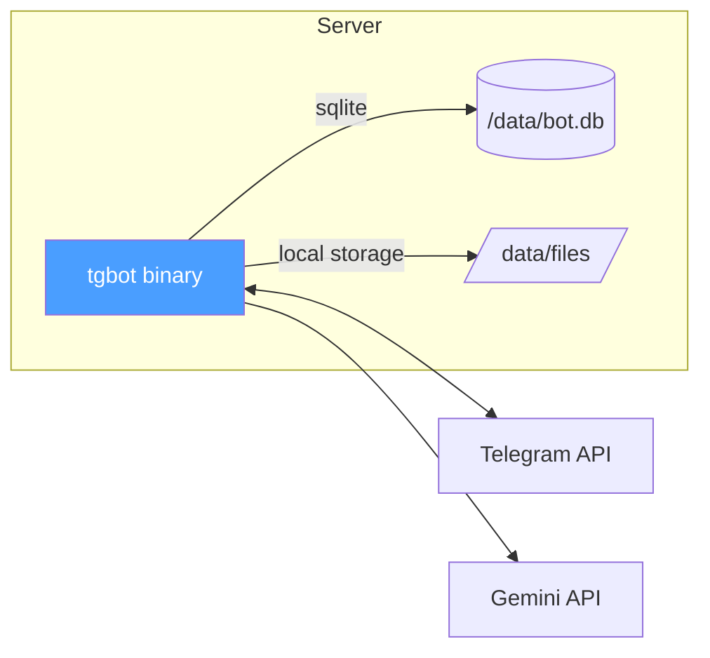

# Deployment

## Docker

```mermaid
graph TB
    subgraph Host
        ENV[.env file<br/>secrets]
        DATA[/data volume<br/>files + db]
    end

    subgraph Container["kaufbot container (scratch)"]
        BIN[tgbot<br/>static binary]
    end

    subgraph External
        TG[Telegram API]
        GM[Gemini API]
        SB[Supabase<br/>optional]
        PG[PostgreSQL<br/>optional]
    end

    ENV -->|mount read-only| BIN
    DATA -->|mount r/w| BIN
    BIN <-->|polling| TG
    BIN -->|OCR| GM
    BIN -.->|supabase backend| SB
    BIN -.->|postgres backend| PG

    style Container fill:#1a1a2e,color:#fff
    style BIN fill:#4a9eff,color:#fff
```

## Docker Compose

```yaml
services:
  kaufbot:
    build: .
    restart: unless-stopped
    env_file: .env
    volumes:
      - ./data:/data
```

## Bare Metal



## Environment Matrix

| Backend | Storage | Database | Data Path |
|---------|---------|----------|-----------|
| local + sqlite | `/data/files/` | `/data/bot.db` | single volume |
| local + postgres | `/data/files/` | external PG | split storage |
| supabase + sqlite | Supabase bucket | `/data/bot.db` | split storage |
| supabase + postgres | Supabase bucket | external PG | fully external |
