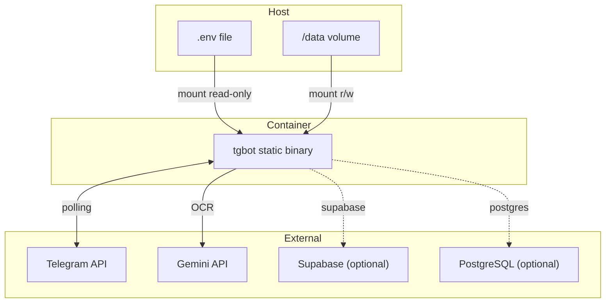
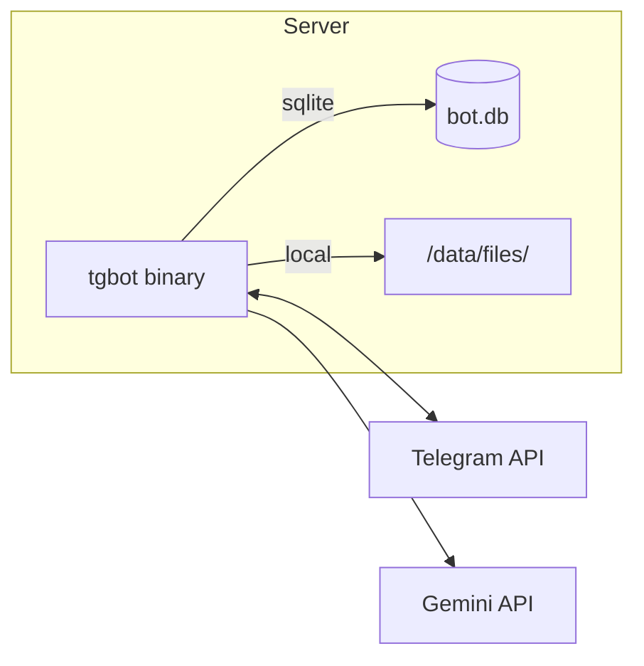

# Deployment

## Docker



## Docker Compose

```yaml
services:
  kaufbot:
    build: .
    restart: unless-stopped
    env_file: .env
    volumes:
      - ./data:/data
```

## Bare Metal



## Environment Matrix

| Backend | Storage | Database | Data Path |
|---------|---------|----------|-----------|
| local + sqlite | `/data/files/` | `/data/bot.db` | single volume |
| local + postgres | `/data/files/` | external PG | split storage |
| supabase + sqlite | Supabase bucket | `/data/bot.db` | split storage |
| supabase + postgres | Supabase bucket | external PG | fully external |
