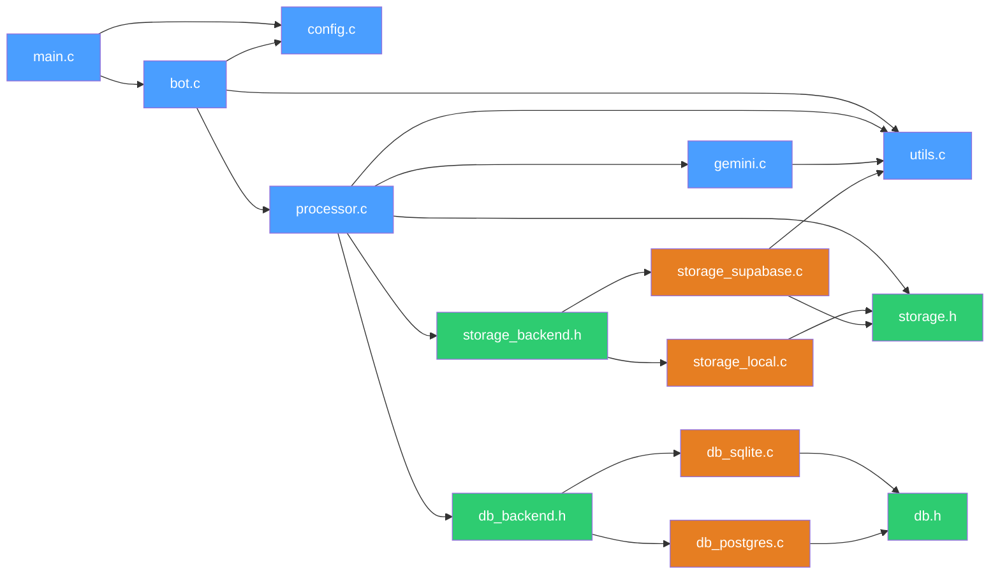

# Module Dependencies

```mermaid
graph LR
    main[main.c] --> bot[bot.c]
    main --> config[config.c]

    bot --> processor[processor.c]
    bot --> config
    bot --> utils[utils.c]

    processor --> gemini[gemini.c]
    processor --> storage_backend[storage_backend.h]
    processor --> db_backend[db_backend.h]
    processor --> utils
    processor --> storage[storage.h]

    gemini --> utils

    storage_backend --> storage_local[storage_local.c]
    storage_backend --> storage_supabase[storage_supabase.c]

    db_backend --> db_sqlite[db_sqlite.c]
    db_backend --> db_postgres[db_postgres.c]

    storage_local --> storage
    storage_supabase --> storage
    storage_supabase --> utils

    db_sqlite --> db[db.h]
    db_postgres --> db

    style main fill:#4a9eff,color:#fff
    style bot fill:#4a9eff,color:#fff
    style processor fill:#4a9eff,color:#fff
    style gemini fill:#4a9eff,color:#fff
    style config fill:#4a9eff,color:#fff
    style utils fill:#4a9eff,color:#fff
    style storage_backend fill:#2ecc71,color:#fff
    style db_backend fill:#2ecc71,color:#fff
    style storage fill:#2ecc71,color:#fff
    style db fill:#2ecc71,color:#fff
    style storage_local fill:#e67e22,color:#fff
    style storage_supabase fill:#e67e22,color:#fff
    style db_sqlite fill:#e67e22,color:#fff
    style db_postgres fill:#e67e22,color:#fff
```

Blue = core logic, Green = interfaces/headers, Orange = backend implementations.
